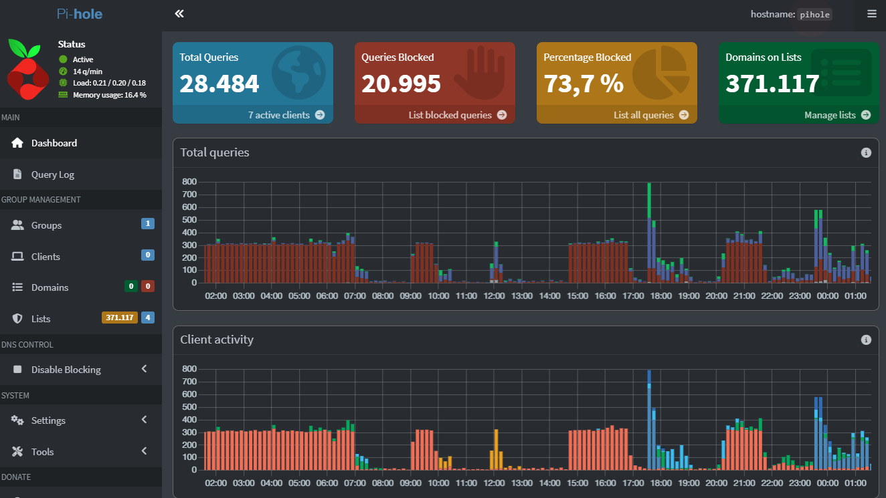

# 🛡️ Pi-hole + Unbound (Docker Edition) - Power User


> "You are the master of your own network."

This project deploys a professional **Ad Blocking** and **DNS Sovereignty** solution using **Docker** containers.
It replaces your ISP's or Google's DNS with a private, encrypted infrastructure that is 100% controlled by you.

---

### 🛑 STOP: READ BEFORE USE

**This project is NOT "Plug & Play".**
For this to work on your home network, **you must** understand the basics of networking.

**Mandatory Requirements:**
1.  **Static IP:** Your Server (Raspberry Pi/PC) MUST have a static IP assigned by your Router (e.g., `192.168.88.88`).
2.  **Time Synchronization:** The Host machine MUST have the correct time and date. DNSSEC relies on cryptographic timestamps; if your time is off, DNS resolution will fail.
3.  **Persistence:** Use an external SSD (like Samsung T5) for the `/docker` folder to prevent microSD corruption.

---

### Software Architecture

* **[Pi-hole v6](https://pi-hole.net/):** The Shield ("DNS Sinkhole"). It intercepts and blocks requests for ads, trackers, and telemetry at the network level.
* **[Unbound](https://github.com/klutchell/unbound):** The Recursive Resolver. It queries the Internet Root Servers directly, ensuring data integrity and removing intermediaries.
* **[Docker](https://www.docker.com/):** Ensures an isolated, reproducible, and clean deployment.

---

## Privacy & Sovereignty Philosophy

This project strictly adheres to the **Data Sovereignty** principle:

* **Zero Reliance:** We do not rely on upstream providers like Google (`8.8.8.8`) or Cloudflare (`1.1.1.1`).
* **Privacy by Design:** By using recursive resolution, no single entity centralizes your browsing history. You are your own DNS provider.
* **Security:** DNSSEC validation is enforced to prevent DNS spoofing.

---

## Installation & Deployment

### 1. Prerequisites

* **Hardware:** Raspberry Pi 4 (4GB RAM) or higher recommended.
* **Software:** Docker and Docker Compose installed.
* **Network:** Port **53** must be free on the host machine.

### 2. File Structure

Create the following folder structure.
*Note: The `.gitignore` file is vital to avoid uploading logs and private data to GitHub.*

```text
privacy-shield/
├── .env                <-- Local secrets (ignored by Git)
├── .gitignore          <-- Prevents leaking private data
├── docker-compose.yml
└── etc-unbound/
    └── unbound.conf    <-- Recursive configuration
```

**Recommended content for `.gitignore`:**
```text
etc-pihole/
etc-dnsmasq.d/
etc-unbound/
*.log
.DS_Store
.env
```

### 3. Service Definition (`docker-compose.yml`)

We use a static internal network (`10.10.10.0/24`).
**CRITICAL:** This configuration includes `cap_add` and time volume mappings to prevent DNSSEC failures on modern Pi-hole versions.

```yaml
services:
  unbound:
    container_name: unbound
    image: klutchell/unbound:latest
    restart: unless-stopped
    hostname: unbound
    volumes:
      - ./etc-unbound:/opt/unbound/etc/unbound/
    networks:
      privacy_net:
        ipv4_address: 10.10.10.2

  pihole:
    container_name: pihole
    image: pihole/pihole:latest
    restart: unless-stopped
    hostname: pihole
    depends_on:
      - unbound
    ports:
      - "53:53/tcp"
      - "53:53/udp"
      - "8080:80/tcp" 
    cap_add:
      - SYS_TIME
      - SYS_NICE
    environment:
      - TZ=${TIMEZONE}
      - WEBPASSWORD=${PIHOLE_WEB_PASSWORD}
      - PIHOLE_DNS_=${PIHOLE_DNS_IP}#53
      - DNSSEC=true
      - DNSMASQ_LISTENING=all
    volumes:
      - ./etc-pihole:/etc/pihole
      - ./etc-dnsmasq.d:/etc/dnsmasq.d
      - /etc/localtime:/etc/localtime:ro
      - /etc/timezone:/etc/timezone:ro
    networks:
      privacy_net:
        ipv4_address: 10.10.10.3

networks:
  privacy_net:
    driver: bridge
    ipam:
      config:
        - subnet: 10.10.10.0/24
```

### 4. Deployment

You can use the included automated script or run it manually:

```bash
docker compose up -d
```

---

## Dashboard Access

**URL Format:** `http://<YOUR_LOCAL_IP>:8080/admin`




---

## ⚙️ Critical Post-Install Configuration

Mandatory steps in the web dashboard:

### 1. Link to Unbound (Upstream DNS)

* Go to **Settings > DNS**.
* **Uncheck** all external providers (Google, OpenDNS, etc).
* In **"Custom 1 (IPv4)"**, type: 👉 **`10.10.10.2#53`**
* **IMPORTANT:** Ensure the **"Use DNSSEC"** box is **CHECKED**.


### 2. Permit Docker Traffic (CRITICAL) ⚠️

* In the same DNS tab, under **"Interface Settings"**.
* Select the option: 👉 **"Permit all origins"** (Or verify `pihole.toml` listeningMode="all").

> **Why?** Due to Docker's internal networking (NAT), requests appear to come from the internal Docker IP range, not your LAN. If you restrict this, Pi-hole will block valid queries. This is safe as long as port 53 is not exposed to the WAN (Internet).

### 3. Add Blocklists

1.  Go to **Group Management > Adlists**.
2.  Add recommended URLs (StevenBlack, Firebog, etc).
3.  Go to **Tools > Update Gravity** and click **Update**.

---

## Router Configuration

⚠️ **ATTENTION:** Perform these steps **ONLY** after you have verified the dashboard works.

1.  **IP Reservation:** Lock your Raspberry Pi's IP (e.g., `192.168.88.88`) in your Router's DHCP settings.
2.  **DNS Assignment:** Change your Router's **Primary DNS** to your Raspberry Pi's IP. Leave Secondary DNS **EMPTY**.
3.  **Disable IPv6 (Recommended):** To prevent leaks, disable IPv6 on your Router or individual clients if possible.

### 🛰️ Advanced: MikroTik NAT Hijacking (Optional)
If you use a MikroTik router, apply these rules to force all devices to use Pi-hole (prevents hardcoded DNS bypass):

```routeros
# Redirect external DNS queries to Pi-hole
/ip firewall nat
add chain=dstnat protocol=udp dst-port=53 src-address=!192.168.88.88 \
    action=dst-nat to-addresses=192.168.88.88 to-ports=53 comment="DNS Hijacking"

# Fix Hairpin NAT for internal resolution
/ip firewall nat
add chain=srcnat protocol=udp src-address=192.168.88.0/24 dst-address=192.168.88.88 \
    dst-port=53 action=masquerade comment="Fix Hairpin NAT"
```

---

## Troubleshooting

### "BOGUS" or "Servfail" on all domains
This usually means the time is out of sync.
1. Check host time: `date`
2. Check container time: `docker exec -it pihole date`
3. If they differ, ensure `cap_add: SYS_TIME` is in your compose file and restart.

### Port 53 Conflict (Ubuntu)
If `systemd-resolved` occupies port 53:
1. `sudo nano /etc/systemd/resolved.conf` -> set `DNSStubListener=no`
2. `sudo systemctl restart systemd-resolved`

### Password Reset
```bash
docker exec -it pihole pihole -a -p
```

---

## 📜 License

MIT Licence

---

### 👤 Author

**[José Álvarez Dominguez]**
* [GitHub Profile](https://github.com/alvarezdevnet)
* [LinkedIn](https://www.linkedin.com/in/jadomin/)